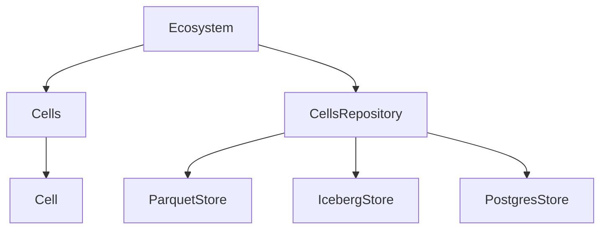

### Ecosystem & cells design overview

We’ll treat `Cell`/`Cells` as domain objects and build an `Ecosystem` orchestration layer plus a pluggable persistence layer that can write/read ecosystems to Parquet now, keep the schema/layout Iceberg-ready (without implementing Iceberg writes yet), and preserve a clean path to a Postgres-backed implementation.

### 1. Clarify roles of existing classes
- **`Cell` (`condorgp/cells/cell.py`)**
  - Stays as the atomic domain object: identity (`cell_ref`, `t_uuid`), type, score, status, history.
  - We may later add methods for cell-level behaviour, but for now it’s a pure data holder.
- **`Cells` (`condorgp/cells/cells.py`)**
  - Becomes an in-memory collection/aggregate over many `Cell` instances (creation, lookup, “simple_static_evaluation_score`, etc.).
  - Avoid global/class-level state; move to instance-level structures so we can have multiple `Cells` collections at once.
- **`Ecosystem` (`condorgp/ecosystem.py`)**
  - Becomes the top-level aggregate root for simulations/trading runs.
  - **Responsibilities** (conceptual, not all implemented at once):
    - Own one or more `Cells` collections (e.g. per population, per strategy bucket).
    - Expose operations like `step()`, `run_gp_iterations(n)`, `run_trade_iterations(n)` that mutate the ecosystem.
    - Delegate persistence to an injected repository, rather than knowing storage details itself.

### 2. In-memory ecosystem data structure
- **Core idea**
  - Represent the ecosystem as a composition of:
    - **Metadata**: run id, timestamps, description, config (e.g. GP hyperparams, trading params).
    - **Cells collection(s)**: one or more `Cells` instances (each with a list of `Cell` objects).
- **Python structures**
- `EcosystemState` dataclass (new) capturing the serializable view of the ecosystem:
    - `run_id: str` (time-prefixed identifier, e.g. `YYYYMMDDHHMMSS-<uuid>`, so lexicographic ordering matches chronological ordering)
    - `created_at`, `updated_at`
    - `config: dict[str, Any]`
    - `cells: list[Cell]` or `dict[str, list[Cell]]` when we have multiple sub-populations.
  - `Ecosystem` holds an `EcosystemState` and domain logic; it can serialize/deserialize via helper methods, but doesn’t talk to the filesystem/DB directly.
- **Scalability hook**
  - Keep the in-memory representation simple (lists/dicts of `Cell`) and let the persistence layer handle partitioning/sharding when datasets become large.

### 3. Persistence abstraction / repository layer
- **Repository interface**
  - Introduce a `CellsRepository` (or `EcosystemRepository`) protocol/ABC in a new module, e.g. `[condorgp/persistence/repository.py](condorgp/persistence/repository.py)`:
    - `save(state: EcosystemState) -> None`
    - `load(run_id: str) -> EcosystemState`
    - Potentially `append_cells(run_id, cells)` and `list_runs(filters)` later.
  - This interface is **storage-agnostic**, enabling:
    - `ParquetEcosystemRepository`
    - `IcebergEcosystemRepository`
    - `PostgresEcosystemRepository`
- **Dependency injection for testability**
  - `Ecosystem`’s constructor accepts a `repository` argument typed as the interface:
    - `def __init__(self, repository: EcosystemRepository, *, state: EcosystemState | None = None): ...`
  - Tests can inject:
    - **In-memory fake repository** that just keeps a dict from `run_id` to `EcosystemState`.
    - **Temporary-directory Parquet repository** for light integration tests.

### 4. Parquet-centric design (Phase 1 focus)
- **Decisions locked**
  - Use **Parquet as the v1 persistence engine**.
  - Use **append-only, versioned snapshots** as the default save model.
  - Keep the layout/schema **compatible with a future Iceberg table**, but do **not** prescribe or depend on a `data/ecosystem/...` path; the concrete storage root will be configurable.
- **Logical schema for Parquet**
  - A **cell table** with columns such as:
    - `run_id` (string, time-prefixed `YYYYMMDDHHMMSS-...` so lexicographic ordering reflects time)
    - `cell_ref` (string/int)
    - `t_uuid` (string/timestamp)
    - `cell_type` (enum/string)
    - `score` (float/int)
    - `status` (enum/string)
    - `score_status` (enum/string)
    - `score_hist` (list/array or JSON-encoded string to start)
    - `timestamp` (logical event time, optional)
  - An **ecosystem runs table** (or a separate Parquet dataset) with:
    - `run_id` (same time-prefixed string), creation time, config JSON, summary metrics.
- **File layout**
  - The Parquet repository takes a **configurable root path**, e.g.:
    - For production/scratch runs: a path passed in by the caller (not hard-coded in the plan).
    - For tests: under `tests/test_data/ecosystem/...` so test fixtures live in `tests/test_data`.
  - Within that root, we still use a partitioned layout by `run_id` and `version` (e.g. `cells/run_id=<run_id>/version=<version>/part-000.parquet`) to stay Iceberg-friendly without committing to a specific global `data/ecosystem` root.
- **Using Parquet directly (first step)**
  - Implement `ParquetEcosystemRepository` using pandas/pyarrow:
    - On `save(state)`, convert cells into a `DataFrame` and write/append to the `cells` dataset under the configured root.
    - Store `EcosystemState` metadata (config, timestamps) in a separate `runs` dataset (single-row `DataFrame`) under the same root.
  - v1 save behaviour:
    - **Append-only with versioning**: each save writes a new snapshot/version id for the `run_id`.
    - Reads default to the latest snapshot unless a specific version is requested.

### 5. Operations on cells (left open but guided)
- **Extensible ops model**
  - Keep `Ecosystem`’s public surface small and behaviour-agnostic for now:
    - `def add_cells(self, cells: list[Cell])`
    - `def apply_operation(self, op: Callable[[Cell], Cell] | CellOperation)` where `CellOperation` is a small strategy/protocol.
  - Later we can formalise operations into an `Operation`/`Transformation` abstraction, but the ecosystem’s data model and persistence won’t depend on specific operations.

### 6. Testing strategy & dependency injection patterns (Phase 1)
- **Unit tests for domain logic**
  - Tests for `Cell` and `Cells` operating purely in memory.
  - Tests for `Ecosystem` that:
    - Use an in-memory fake repository (simple dict-backed) implementing the repository interface.
    - Verify `run_gp_iterations`/`run_trade_iterations` only rely on the repo for `save`/`load` and not on file paths or DB connections.
- **Integration tests for persistence**
  - Parquet:
    - Use a `tmp_path` fixture to create `ParquetEcosystemRepository` with a temp directory.
    - Save multiple snapshots for the same `run_id`, load latest and specific versions, and compare.
  - Iceberg (later):
    - Add catalog-level tests only when the Iceberg repository is implemented.
  - Postgres (optional):
    - Use a test DB/transactional fixtures if needed.
- **Dependency injection patterns**
  - `Ecosystem` takes its repository and maybe other collaborators (e.g. random number provider, evaluation function) as constructor arguments with sane defaults.
  - This makes simulations deterministic in tests (injecting a seeded RNG or mock evaluator).

### Phase 2: Postgres, Iceberg integration, and scaling

#### 7. Postgres option
- **Schema design**
  - A `ecosystem_runs` table mirroring the Parquet `runs` data:
    - `run_id` (PK, text; time-prefixed `YYYYMMDDHHMMSS-...` so ordering by `run_id` matches chronological ordering), timestamps, config JSON, summary metrics.
  - A `cells` table:
    - `id` (PK), `run_id` (FK), `cell_ref`, `t_uuid`, `cell_type`, `status`, `score_status`, `score`, `score_hist` (JSONB), `created_at`.
- **Repository implementation**
  - `PostgresEcosystemRepository` implementing the same interface, using an injected DB connection/`Session`.
  - Can be implemented later without changing `Ecosystem`, tests, or other call sites; only the DI wiring changes.

#### 8. Apache Iceberg pathway
- Once/if Apache Iceberg is adopted, we can:
  - Wrap the same logical schema as an Iceberg table using PyIceberg or an engine like Spark/Trino.
  - Introduce an `IcebergEcosystemRepository` that uses Iceberg’s table API for writing/reading while keeping the repository interface unchanged.
- Switching from plain-Parquet to Iceberg remains a matter of changing the concrete implementation and configuration, not domain code.

#### 9. Handling unknown future load / scaling
- **Design for uncertainty**
  - Do **not** hard-code limits in the domain model; let the repository decide whether to:
    - Load entire ecosystems into memory vs. stream/iterate.
    - Partition data by run, time, or generation.
  - Introduce a thin `EcosystemView` concept later if we need partial loading (e.g. only recent generations or a sampled subset of cells).
- **Versioning and schema evolution**
  - Add a `schema_version` field in `EcosystemState` and in the Parquet/DB metadata.
  - Keep a small migration layer (e.g. `upgrade_state(old_state) -> EcosystemState`) to evolve the schema as we learn more about the data volume and operations.

### 10. Concrete first implementation steps (for execution phase)
- **Step 1**: Refine `Cells` to be instance-based and side-effect free (no class-level `__cell_record` for production usage) while keeping existing behaviour.
- **Step 2**: Introduce `EcosystemState` dataclass and refactor `Ecosystem` in `ecosystem.py` to hold state and accept a repository via DI.
- **Step 3**: Define `EcosystemRepository` interface and implement `InMemoryEcosystemRepository` for tests.
- **Step 4**: Implement `ParquetEcosystemRepository` that writes append-only versioned snapshots of cells/runs to a partitioned layout suitable for later Iceberg adoption.
- **Step 5**: Add unit tests for `Ecosystem` with in-memory repo, and integration tests for Parquet repo using temporary directories.
- **Step 6**: Sketch a `PostgresEcosystemRepository` interface and docs (including equivalent snapshot semantics), deferring full implementation until DB requirements are clearer.
